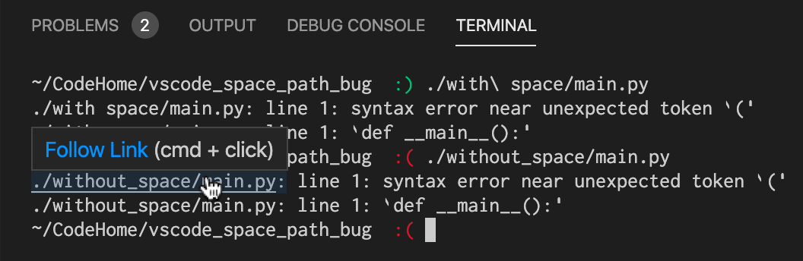
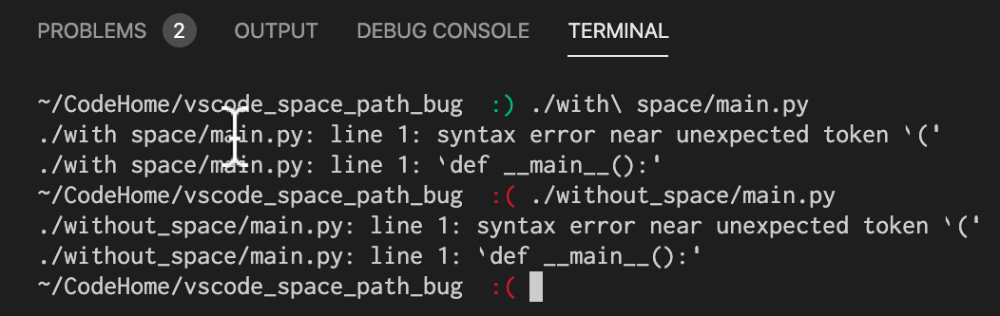

# VSCode space path terminal link bug

Reproduction of non-clickable links in Code due to spaces in path.

VSCode renders paths in its terminal as clickable links to resources. Sadly, these are not rendered as links or clickable when the path contains a space. 

This repo contains two folders with a python program that divides by 0 to produce an error. One has a space in the path, the other does not. 

Executing the code in the folder without the space results in VSCode rendering a clickable link in the terminal. 

Executing the code in the folder with a space results in VSCode not rendering a clickable link.

